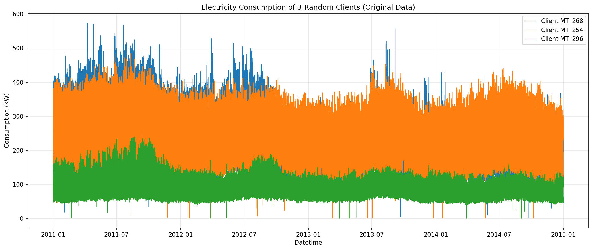
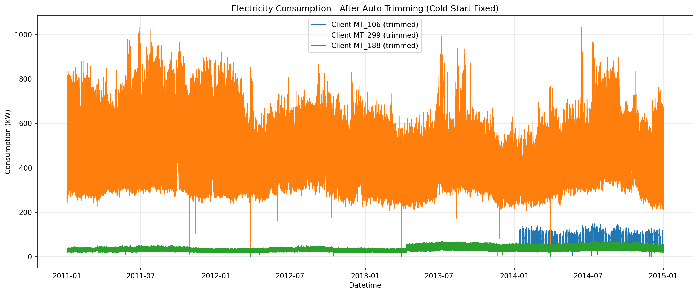
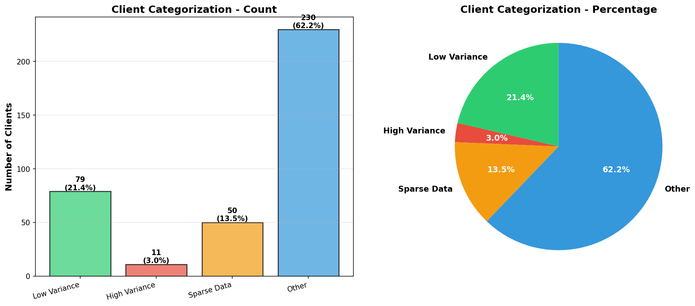

# Energy Consumption Prediction Project

## Abstract

This project presents a comprehensive analysis of electricity consumption patterns and develops predictive models using machine learning and deep learning techniques. The study addresses the Cold Start problem in time series data and implements Long Short-Term Memory (LSTM) networks with hyperparameter optimization for accurate consumption forecasting.

## Introduction

The increasing demand for efficient energy management systems requires accurate prediction models for electricity consumption. This research focuses on analyzing consumption patterns from multiple clients, identifying data quality issues such as the Cold Start problem, and developing robust forecasting models using deep learning approaches.

## Project Structure

```
Power-Grid-Repo/
├── notebooks/              # Jupyter notebooks for exploration and analysis
│   ├── grid_client_consumption.ipynb
│   └── nrel_grid_solar_data.ipynb
├── scripts/                # Python scripts for data processing and model training
│   ├── main.py             # Main analysis script
│   ├── client_categorization.py
│   ├── lstm_training.py
│   ├── experiment_tracker.py
│   ├── error_handler.py
│   └── report_generator.py
├── data/                   # Dataset files
│   ├── raw/                # Raw data files (not tracked in git)
│   └── processed/          # Processed/cleaned data
│       ├── experiments/    # Experiment results and reports
│       └── plots/         # Visualization outputs
├── .gitignore
├── .python-version
├── requirements.txt
└── README.md
```

## Methodology

### Data Processing

The analysis pipeline includes several key preprocessing steps:

1. **Data Loading**: Electricity consumption data is loaded from semicolon-separated files with datetime indexing
2. **Cold Start Detection**: Leading zeros are automatically identified and removed to prevent model bias
3. **Client Categorization**: Clients are classified into three categories:
   - **Low Variance (Stable)**: Regular consumers with predictable patterns
   - **High Variance (Irregular)**: Challenging consumers where deep learning shows potential
   - **Sparse Data**: Consumers with intermittent consumption patterns

### Visualization Results

The following visualizations demonstrate the data processing pipeline and client categorization:

#### Consumption Data Before and After Trimming



*Figure 1: Electricity consumption patterns for three randomly selected clients before trimming. The visualization shows the original time series data with potential Cold Start issues.*



*Figure 2: Electricity consumption patterns after applying Cold Start trimming. The leading zeros have been removed, resulting in cleaner time series data for model training.*

#### Client Categorization Analysis


*Figure 3: Client categorization results before trimming. This analysis shows the initial distribution of clients across different variance categories.*



*Figure 4: Client categorization results after trimming. The removal of Cold Start data reveals more accurate categorization, with a significant reduction in High Variance clients and better identification of Sparse Data patterns.*

### Model Architecture

The project implements **Long Short-Term Memory (LSTM)** networks for time series forecasting:

- **Architecture**: Multi-layer LSTM with embedding layers for client representation
- **Hyperparameter Optimization**: Optuna framework for automated hyperparameter tuning will be implemented.

- **Training**: Supports CUDA GPU acceleration on Linux systems with NVIDIA GPUs
- **Evaluation Metrics**: 
  - Mean Absolute Error (MAE)
  - Root Mean Squared Error (RMSE)
  - Mean Absolute Percentage Error (MAPE)

## Installation

### Prerequisites

1. Clone the repository:
```bash
git clone <repository-url>
cd Power-Grid-Repo
```

2. Install dependencies:
```bash
pip install -r requirements.txt
```

3. (Optional) For CUDA GPU acceleration on Linux:
   - Ensure CUDA toolkit and cuDNN are installed on your system
   - TensorFlow will automatically detect and use CUDA-enabled GPUs if available
   - Verify GPU detection: `python -c "import tensorflow as tf; print(tf.config.list_physical_devices('GPU'))"`

## Usage

### Main Analysis Pipeline

Execute the complete analysis pipeline:

```bash
python scripts/main.py
```

This script performs the following operations:
- Data loading and preprocessing
- Client categorization (Low/High Variance, Sparse Data)
- Cold Start problem detection and trimming
- LSTM model training with Optuna hyperparameter optimization
- Results visualization and summary generation
- Comprehensive experiment report generation

### Jupyter Notebooks

For interactive exploration and analysis:

```bash
jupyter notebook notebooks/
```

## Experimental Results

All experimental results are automatically saved in the `data/processed/experiments/` directory. Each experiment includes:

- Comprehensive HTML reports with visualizations
- Client-specific performance metrics
- Hyperparameter optimization trials
- Error logs and recovery information
- System information and execution logs

## Requirements

- Python 3.8+
- TensorFlow 2.8+
- See `requirements.txt` for complete dependency list

## Dataset

The project utilizes the following datasets:

- **UCI Electricity Load Diagrams Dataset**: Contains consumption data for 370 clients from 2011-2014
- **NREL Solar Power Data**: Alabama solar power generation data

**Note**: Large data files are not tracked in git. Place your data files in the `data/raw/` directory.
 

- UCI Machine Learning Repository for the electricity consumption dataset
- NREL (National Renewable Energy Laboratory) for solar power data
